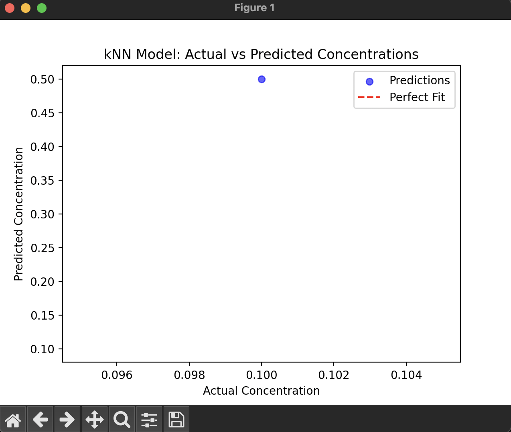

# Shenendehowa-Chemistry-Club

<h1 align="center">Machine Learning Model To Distinguish Copper Ion Concentration in Solution</h1>
<h5 align="center">Hassaan Vani, Grady Chen, Jerry Ma</h5>

  

    By Tweaking ChatGPT code we were able to use this image as a sample image for training:
     
    
     
    Using the ChatGPT Code, the image gave a Mean Absolute Error of 0.4, where an accpted range is between 0.1 and 0.2, as well as a Mean Squared error of 0.16, which should be approaching 0. These errors indicate that we need more training data. This is an implementation of Matplotlib to plot the training data:
     
    
       
Unfortunatley, this data is not correct as with the training image, the RGB values seem to be taken from a random sector of the image, not a centered focus on each chip, this makes the values filed with noise and not true representations. In a sequel code attatched, it can be Cropped alongside a more advanced Tensorflow model rather than a KNN model. With this iteration, we could add a folder of training data and implement a similar Matplotlib function to graph, and later directly implement the prediction model with the same code with a Raspberry Pi and a camera module. 
  

